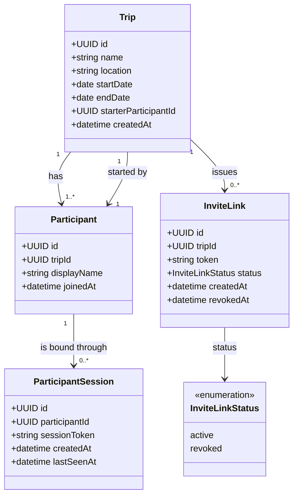

# Domain Model

<!--
  Global, cross-feature domain model for Weekend Away.
  Read before modelling a feature, updated by the /spec skill after every spec.
  The Mermaid diagram is the whole domain, not one feature — keep it in sync with
  the entities and relationships documented below it.
-->

## Overview

## Entities

### Trip

One weekend away. The aggregate root that every other concept hangs off.

| Attribute | Type | Constraints |
| --- | --- | --- |
| id | UUID | PK, generated |
| name | string | required, 1–100 chars |
| location | string | required, 1–200 chars, free text |
| startDate | date | required, ≥ creation date |
| endDate | date | required, ≥ startDate |
| starterParticipantId | UUID | required, FK → Participant, immutable |
| createdAt | datetime | generated, immutable |

Source specs: 001-003-create-and-join-a-trip

### Participant

A person taking part in one trip. Has no account and exists only within its trip.

| Attribute | Type | Constraints |
| --- | --- | --- |
| id | UUID | PK, generated |
| tripId | UUID | required, FK → Trip, immutable |
| displayName | string | required, 1–50 chars, unique per trip (trimmed, case-insensitive) |
| joinedAt | datetime | generated, immutable |

Source specs: 001-003-create-and-join-a-trip

### InviteLink

A shareable credential that admits new participants to one trip. Revocable; superseded
rather than edited.

| Attribute | Type | Constraints |
| --- | --- | --- |
| id | UUID | PK, generated |
| tripId | UUID | required, FK → Trip, immutable |
| token | string | required, globally unique, ≥ 128 bits entropy, URL-safe |
| status | enum | [active, revoked] |
| createdAt | datetime | generated, immutable |
| revokedAt | datetime | set if and only if status = revoked |

Source specs: 001-003-create-and-join-a-trip

### ParticipantSession

The binding between one browser and one participant. This is how identity works in the
absence of accounts: a participant on a phone and a laptop has two sessions.

| Attribute | Type | Constraints |
| --- | --- | --- |
| id | UUID | PK, generated |
| participantId | UUID | required, FK → Participant |
| sessionToken | string | required, unique, ≥ 128 bits entropy, cookie-borne |
| createdAt | datetime | generated, immutable |
| lastSeenAt | datetime | updated on access; drives inactivity expiry |

Source specs: 001-003-create-and-join-a-trip

## Value Objects

_None yet. Trip dates are two plain date attributes rather than a date-range value object;
promote them if a second feature needs range behaviour._

## Relationships

- A **Trip** has many **Participants**; a **Participant** belongs to exactly one **Trip**.
- A **Trip** has exactly one **starter**, which is one of its own **Participants**.
- A **Trip** has many **InviteLinks** over time, but at most one with status `active`.
- A **Participant** has many **ParticipantSessions**; a **ParticipantSession** belongs to
  exactly one **Participant**.

## Domain Rules and Invariants

| ID | Rule | Source specs |
| --- | --- | --- |
| INV-1 | A trip's end date is never before its start date. | 001-003-create-and-join-a-trip |
| INV-2 | A trip's start date is not in the past at creation time. Not re-checked afterwards — a trip already under way stays valid. | 001-003-create-and-join-a-trip |
| INV-3 | No two participants of the same trip share a display name, compared trimmed and case-insensitively. Names may repeat across trips. | 001-003-create-and-join-a-trip |
| INV-4 | A trip always has a starter; the reference is set at creation and never changes. | 001-003-create-and-join-a-trip |
| INV-5 | A trip's starter is a participant of that same trip. | 001-003-create-and-join-a-trip |
| INV-6 | A trip has at most one invite link with status `active`; generating a replacement revokes the incumbent in the same step. | 001-003-create-and-join-a-trip |
| INV-7 | Revocation is terminal — a revoked invite link never becomes active again. | 001-003-create-and-join-a-trip |
| INV-8 | Membership outlives the link: revoking or replacing an invite link never removes or blocks an existing participant. | 001-003-create-and-join-a-trip |
| INV-9 | The invite link is the only credential. Possession of an active token suffices to join as a new participant or resume an existing one; the domain defines no stronger proof of identity. | 001-003-create-and-join-a-trip |

## Ubiquitous Language

| Term | Meaning |
| --- | --- |
| Trip | One weekend away, with a name, a location and a date range. |
| Trip starter | The participant who created the trip; the only one who can revoke or regenerate the invite link. |
| Participant | Anyone taking part in a trip, including the starter. Everyone is an equal contributor to the plan. |
| Invite link | The shareable URL carrying a trip's active invite token. |
| Display name | The name a participant is known by within one trip. |
