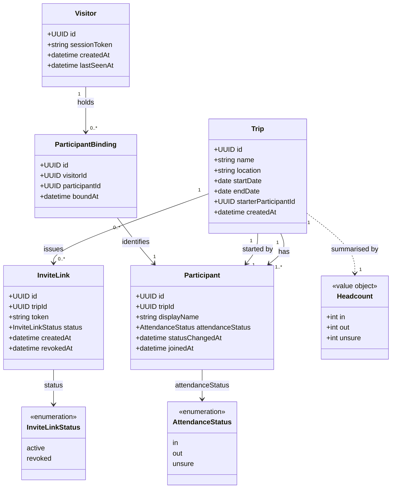

# Domain Model

<!--
  Global, cross-feature domain model for Weekend Away.
  Read before modelling a feature, updated by the /spec skill after every spec.
  The Mermaid diagram is the whole domain, not one feature — keep it in sync with
  the entities and relationships documented below it.
-->

## Overview

## Entities

### Trip

One weekend away. The aggregate root that every other concept hangs off.

| Attribute | Type | Constraints |
| --- | --- | --- |
| id | UUID | PK, generated |
| name | string | required, 1–100 chars |
| location | string | required, 1–200 chars, free text |
| startDate | date | required, ≥ creation date |
| endDate | date | required, ≥ startDate |
| starterParticipantId | UUID | required, FK → Participant, immutable |
| createdAt | datetime | generated, immutable |

Source specs: 001-003-create-and-join-a-trip

### Participant

A person taking part in one trip. Has no account and exists only within its trip.

| Attribute | Type | Constraints |
| --- | --- | --- |
| id | UUID | PK, generated |
| tripId | UUID | required, FK → Trip, immutable |
| displayName | string | required, 1–50 chars, unique per trip (trimmed, case-insensitive) |
| attendanceStatus | enum | required, [in, out, unsure], defaults to `unsure` on joining |
| statusChangedAt | datetime | null until the first change, then updated on every change |
| joinedAt | datetime | generated, immutable |

Source specs: 001-003-create-and-join-a-trip (identity),
004-005-attendance-and-my-trips (attendance)

### InviteLink

A shareable credential that admits new participants to one trip. Revocable; superseded
rather than edited.

| Attribute | Type | Constraints |
| --- | --- | --- |
| id | UUID | PK, generated |
| tripId | UUID | required, FK → Trip, immutable |
| token | string | required, globally unique, ≥ 128 bits entropy, URL-safe |
| status | enum | [active, revoked] |
| createdAt | datetime | generated, immutable |
| revokedAt | datetime | set if and only if status = revoked |

Source specs: 001-003-create-and-join-a-trip

### Visitor

One browser that has used the system — the device-level identity. This is how identity
works in the absence of accounts, and what makes a cross-trip view possible.

| Attribute | Type | Constraints |
| --- | --- | --- |
| id | UUID | PK, generated |
| sessionToken | string | required, unique, ≥ 128 bits entropy, cookie-borne |
| createdAt | datetime | generated, immutable |
| lastSeenAt | datetime | updated on access; drives inactivity expiry |

Source specs: 001-003-create-and-join-a-trip

### ParticipantBinding

Links one visitor to one participant. A visitor holds one binding per trip; a participant
may be bound from several visitors — phone and laptop.

| Attribute | Type | Constraints |
| --- | --- | --- |
| id | UUID | PK, generated |
| visitorId | UUID | required, FK → Visitor |
| participantId | UUID | required, FK → Participant |
| boundAt | datetime | generated, immutable |

Source specs: 001-003-create-and-join-a-trip

## Value Objects

### Headcount

A derived, read-only summary of one trip's participants. Never stored; always computed
from the participants themselves, so it cannot drift out of step with them.

| Attribute | Type | Constraints |
| --- | --- | --- |
| in | integer | ≥ 0 |
| out | integer | ≥ 0 |
| unsure | integer | ≥ 0 |

Source specs: 004-005-attendance-and-my-trips

_Trip dates remain two plain date attributes rather than a date-range value object;
promote them if a later feature needs range behaviour._

## Relationships

- A **Trip** has many **Participants**; a **Participant** belongs to exactly one **Trip**.
- A **Trip** has exactly one **starter**, which is one of its own **Participants**.
- A **Trip** has many **InviteLinks** over time, but at most one with status `active`.
- A **Trip** is summarised by a **Headcount**, derived from its Participants.
- A **Participant** has exactly one **attendance status** at any moment.
- A **Visitor** holds many **ParticipantBindings**; each binding identifies exactly one
  **Participant**.
- A **Participant** may be bound from many **Visitors** (one per device).
- A **Visitor** holds at most one **ParticipantBinding** per **Trip**.
- A **Visitor's** trips are derived — visitor → bindings → participants → trips. There is
  no direct Visitor-to-Trip link to keep in step.

## Domain Rules and Invariants

| ID | Rule | Source specs |
| --- | --- | --- |
| INV-1 | A trip's end date is never before its start date. | 001-003-create-and-join-a-trip |
| INV-2 | A trip's start date is not in the past at creation time. Not re-checked afterwards — a trip already under way stays valid. | 001-003-create-and-join-a-trip |
| INV-3 | No two participants of the same trip share a display name, compared trimmed and case-insensitively. Names may repeat across trips. | 001-003-create-and-join-a-trip |
| INV-4 | A trip always has a starter; the reference is set at creation and never changes. | 001-003-create-and-join-a-trip |
| INV-5 | A trip's starter is a participant of that same trip. | 001-003-create-and-join-a-trip |
| INV-6 | A trip has at most one invite link with status `active`; generating a replacement revokes the incumbent in the same step. | 001-003-create-and-join-a-trip |
| INV-7 | Revocation is terminal — a revoked invite link never becomes active again. | 001-003-create-and-join-a-trip |
| INV-8 | Membership outlives the link: revoking or replacing an invite link never removes or blocks an existing participant. | 001-003-create-and-join-a-trip |
| INV-9 | The invite link is the only credential. Possession of an active token suffices to join as a new participant or resume an existing one; the domain defines no stronger proof of identity. | 001-003-create-and-join-a-trip |
| INV-10 | Every participant has exactly one attendance status. Not having answered is represented by `unsure` — a real answer, not an absence. | 004-005-attendance-and-my-trips |
| INV-11 | Attendance is self-declared: a status may be changed only through a binding to that same participant. No one, including the trip starter, sets another's. | 004-005-attendance-and-my-trips |
| INV-12 | Attendance is never final — no state, date or action makes a status unchangeable. | 004-005-attendance-and-my-trips |
| INV-13 | A trip's headcount is total: `in + out + unsure` equals its participant count. | 004-005-attendance-and-my-trips |
| INV-14 | One identity per trip per device: a visitor holds at most one binding whose participant belongs to a given trip. | 001-003-create-and-join-a-trip |
| INV-15 | A visitor's set of bindings is private to that visitor. Within a trip, a participant's display name and attendance status are visible to co-participants; the existence of their other trips is not. | 004-005-attendance-and-my-trips |

## Ubiquitous Language

| Term | Meaning |
| --- | --- |
| Trip | One weekend away, with a name, a location and a date range. |
| Trip starter | The participant who created the trip; the only one who can revoke or regenerate the invite link. |
| Participant | Anyone taking part in a trip, including the starter. Everyone is an equal contributor to the plan. |
| Invite link | The shareable URL carrying a trip's active invite token. |
| Display name | The name a participant is known by within one trip. |
| Attendance status | A participant's own answer to "are you coming?" — in, out or unsure. |
| Headcount | The derived in/out/unsure summary of a trip's participants. |
| Visitor | One browser. The device-level identity that spans trips. |
| Binding | The link between a visitor and a participant; how a device proves who it is. |

## Model History

| Spec | Change |
| --- | --- |
| 001-003-create-and-join-a-trip | Established Trip, Participant, InviteLink, Visitor and ParticipantBinding, with INV-1 … INV-9 and INV-14. |
| 004-005-attendance-and-my-trips | Added `attendanceStatus` and `statusChangedAt` to Participant, added the Headcount value object, and added INV-10 … INV-13 and INV-15. Changed nothing existing. |
| _(note)_ | 004-005 originally introduced Visitor + ParticipantBinding as a replacement for a per-trip ParticipantSession. That model was folded back into 001-003, where joining a trip is defined, so no spec describes a superseded model. ParticipantSession no longer exists anywhere. |
